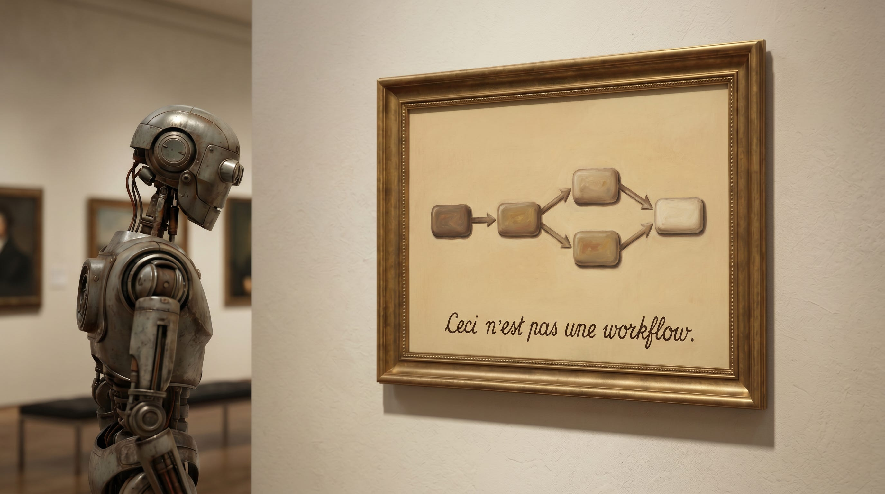

  

# my-precious

**`my-precious` compiles a prompt into a re-runnable workflow — so the words you engineered arrive exactly as you engineered them.**

When an LLM orchestrates subagents, it *authors* their prompts: it paraphrases your instructions, condenses them, quietly embellishes — differently every run. Invisible for a casual prompt. For one whose value lives in precise, hard-won wording, it is death by a thousand quiet edits — a rule marked HARD silently dropped, an answer leaked into the very step meant to find it. There is a lossy compressor between what you wrote and what runs, and it has been told to rewrite.

`my-precious` takes it out. You write a prompt; it compiles into a workflow where **every stage receives its instructions byte-for-byte**, and the orchestration is deterministic code — which cannot paraphrase, because comprehension *was* the corruption vector.

> **The prompt is authoritative over everything it states. The compiler owns only the silences.**

You author markdown; `my-precious` compiles it (no hand-written JavaScript, ever). Two assumptions, both Claude Code's own: it installs and runs as a **skill** — `/my-precious <prompt.md> <context>` — and it compiles to **Claude Code's dynamic Workflows**, the runtime where a deterministic JavaScript orchestrator can drive a swarm of subagents. You run the same artifact against context after context, and anyone, invested or not, can lay its output beside the source and check it, byte for byte.

_The longer argument — the paraphrase corruption in full, and the compiler that compiled itself and then out-faithed its author under a blind judge — is the companion essay: **[Ceci n'est pas une workflow](https://sentientsergio.substack.com/p/ceci-nest-pas-une-workflow)**._

### Usage
`/my-precious <prompt.md> <context>`

### Three things
- **`prompt.md` is source.** It states a goal and, to whatever degree it likes, a workflow — anywhere from a bare problem to a fully prescribed pipeline.
- **The workflow `.js` is the compiled artifact** — a first-order deliverable that runs on Claude Code's existing dynamic-workflow runtime. `my-precious` never builds a runtime; it emits code for the one already here.
- **`<context>` is runtime input.** One binary, many contexts. Context never touches compilation.

  

### The compile
Recover the workflow latent in the prompt — honor whatever it prescribes, synthesize the rest — and emit the workflow that executes it.

**The membrane — the prompt is authoritative over everything it states; the compiler owns its silences:**
- Every instruction a stage receives is **quoted** from `prompt.md`, never paraphrased — goal, constraint, or prescribed orchestration alike.
- Where the prompt is silent, the compiler supplies the how via three verbs — **partition, sequence, resource.** It fills gaps; it never overrides what's stated and never authors content.
- Prescriptiveness is just how much the prompt states. A fully prescribed prompt leaves the compiler only plumbing; a bare problem leaves it the whole decomposition. One law throughout. Model selection is the compiler's optimization pass, read off each stage's semantics, only over stages the prompt didn't already tier.

### Auto-make
- The artifact is written beside the prompt (`prompt.md` → `prompt.workflow.js`), a hash embedded in its header.
- The hash covers `prompt.md` **and** `my-precious`'s own version.
- On invocation: hash matches → run; missing or stale → recompile → run.
- The `.js` is always regenerable and never hand-edited. `prompt.md` is the single source of truth.

### Diagnostics
Compilation may report a fixable weakness in the prompt, or the per-stage model choices it made. These surface to you — optionally as proposed edits to `prompt.md` — never written into the regenerable `.js`.
