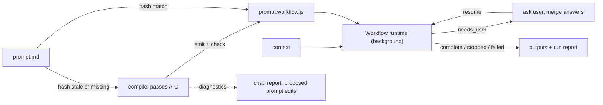

# my-precious — design

**Phase:** design. Upstream: [README.md](README.md) (define). Downstream: implementation.
**Specimen:** [test-specimen/staker.md](test-specimen/staker.md) — the fully-prescribed end of the prompt spectrum; §11 compiles it on paper.

This document decides the architecture. Anything labeled **Decision** is settled; implementation should not reopen it without surfacing the conflict. Anything labeled **Probe** is an assumption to verify on day one of implementation, with the design's fallback stated.

---

## 0. Contract recap

Three sentences from the define phase govern everything below.

1. *"You write a prompt; it emits the workflow JavaScript that executes it, on Claude Code's runtime"* — the target is the existing dynamic-workflow runtime (the `Workflow` tool). my-precious never builds an executor.
2. *"Every instruction a stage receives is **quoted** from `prompt.md`, never paraphrased"* and *"Where the prompt is silent, the compiler supplies the how via three verbs — partition, sequence, resource."* — the membrane. §4 operationalizes it.
3. *"On invocation: hash matches → run; missing or stale → recompile → run."* — auto-make. §9 specifies it.

Vocabulary used throughout:

- **prompt** — the source `prompt.md`.
- **artifact** — the emitted `prompt.workflow.js`, written beside the prompt (`staker.md` → `staker.workflow.js`).
- **stage** — one unit of the recovered workflow; compiles to one `agent()` call (or a small cluster of them).
- **span** — a contiguous, line-addressed excerpt of the prompt, the only carrier of instruction text.
- **plumbing** — compiler-authored connective text, drawn from a closed grammar (§4.3).
- **envelope** — the `args` object the skill passes at run time (§3.4).
- **boundary** — a point where the workflow must pause for user input (§6).

---

## 1. System shape

Five components. One is the deliverable of each run; one already exists.

| Component | Nature | Role |
|---|---|---|
| `SKILL.md` | skill instructions | Invocation parsing, auto-make, the run loop (§9); hosts the compile procedure the compiler agent follows (§7) |
| compiler agent | subagent, spawned per compile | Executes passes A–G against the prompt; the only place semantic judgment enters compilation |
| `scripts/emit.mjs` | node script | Resolves `$SPAN` placeholders by copying prompt bytes; stamps the hash header. The model never retypes source text |
| `scripts/check.mjs` | node script | Mechanical gates on the artifact (§7, pass F1) |
| `prompt.workflow.js` | emitted artifact | The compiled workflow; runs on the existing runtime |



**Decision D1 — the compile is semantic and delegated; everything around it is mechanical and scripted.** Recovering the latent workflow, classifying spans, and filling silences require judgment, so a model does them — in a dedicated compiler subagent, because a 40k-token prompt read plus emission would otherwise consume the session context. Hashing, span copying, and artifact validation must be deterministic, so scripts do them. The run loop stays in the session main loop because only it can call `Workflow` and ask the user questions.

The compiler agent **inherits the session model**, and the artifact header records which model compiled it (§3.1) — provenance, not a diagnostic. Compilation is the system's most judgment-heavy task: the machinery can be built by any competent model, but large prescriptive prompts should be compiled from a senior-model session. Because artifacts are regenerable, deleting one (or bumping VERSION) forces the next invocation to recompile from a better seat — no force flag needed.

**Decision D2 — content flows through files; control flows through returns.** Stage agents read and write files (they have tools); the workflow script cannot (the runtime bans filesystem access). So the script threads only file paths and small schema-validated control objects — status, counts, item lists, stop signals, questions. No document content ever transits an `agent()` return. This is also exactly the specimen's own handoff rule, which makes the lowering natural: *"Sub-agents write structured output to files and return a one-line status."*

**Decision D3 — the prompt's "main context" lowers to coordinator agents inside the workflow, never to the session main loop.** A prompt like the specimen assigns real work to "the main context" (consolidation, challenge, allocation). The artifact must be self-contained and re-runnable, so those steps become `agent()` calls like any other — agents that read the named files, do the step, write the result. The session main loop's only mid-run role is mediating user interaction at boundaries (§6). "Main context" in a prompt is a role name, not a placement directive.

---

## 2. Target ABI — frozen for v1

The compiler emits against this table, and `check.mjs` enforces the mechanical rows. It reflects the runtime as of 2026-07; §13 covers drift.

| # | Runtime fact | Obligation on the artifact |
|---|---|---|
| 1 | Script must open with `export const meta = {...}` as a pure literal; `name`, `description` required; optional `phases: [{title, detail, model?}]` matched to `phase()` calls by exact title | Emit meta as a JSON-literal island (§3.1); every `phase()` title appears in `meta.phases` |
| 2 | `agent(prompt, opts)` → final text as string, or schema-validated object when `opts.schema` given; `null` if the user skips the agent or it dies on a terminal error | Control returns always use `schema`; every `await agent(...)` is null-guarded (§3.6) |
| 3 | `opts`: `label`, `phase`, `model` ∈ {sonnet, opus, haiku, fable}, `effort` ∈ {low..max}, `isolation:'worktree'`, `agentType` | Resource pass writes only these keys; `model` omitted = inherit session model (§8) |
| 4 | `pipeline(items, ...stages)` — no barrier; a throwing stage nulls that item. `parallel(thunks)` — barrier; a throwing thunk yields `null`; never rejects | `.filter(Boolean)` after every fan-out; dropped-item counts are `log()`ed — no silent truncation |
| 5 | `log(msg)`, `phase(title)` for progress; inside concurrent groups use `opts.phase`, not global `phase()` | One `log()` per completed stage carrying the stage's returned status line |
| 6 | `args` arrives verbatim | Script reads only documented envelope fields (§3.4); no other `args.` access |
| 7 | No filesystem, no Node APIs, no TypeScript syntax; `Date.now()` / `new Date()` / `Math.random()` throw (resume determinism) | All I/O in agents; time enters via envelope (`invokedAt`, `runStamp`); no randomness |
| 8 | Caps: ~`min(16, cores−2)` concurrent agents; 1000 agents per run; 4096 items per `pipeline`/`parallel` call | Fan-outs over data-determined lists guard the counts; prompt-prescribed batching is honored as written |
| 9 | Subagents are told their final text is a return value, not a user-facing message; they run headless; MCP tools reachable via ToolSearch, interactive-auth servers possibly absent | Stage prompts never ask an agent to "tell the user" anything; user-facing text is the `log()`ed status line |
| 10 | Resume: `Workflow({scriptPath, resumeFromRunId})` replays the longest unchanged prefix of `agent()` calls (keyed on prompt + opts) from cache; same-session only | Boundary protocol (§6) depends on this; pre-boundary stage prompts must not interpolate later-round answer fields |
| 11 | `workflow()` nests one level | Unused in v1 (§12 non-goals); `check.mjs` fails on its presence |
| 12 | The Workflow tool requires explicit user opt-in; a skill whose instructions direct the call satisfies it | `SKILL.md` states plainly that invocation of `/my-precious` directs a `Workflow` call |
| 13 | Workflow runs in background; the tool returns a task id; completion arrives as a task notification carrying the script's return value | The run loop launches, waits on the notification, dispatches on the result contract (§3.5) |
| 14 | Top-level `return` ends the script; the returned value is the workflow result | The script returns only result-contract objects |

**Probe P1** — the default workflow subagent's toolset includes Read/Write/Bash and web access (WebSearch/WebFetch). Everything in the runtime docs implies it (migration workflows edit files; research workflows search). Fallback if wrong: set `agentType` to a full-tool agent in emitted `opts`.
**Probe P2** — resume caching holds when a re-invocation adds envelope fields that only post-boundary prompts interpolate. The prefix property should hold by construction. Fallback: re-run from scratch on each boundary round (correct, slower; same-day run dirs make it idempotent for the specimen, wasteful in general).
**Probe P3** — workflow agents cannot ask the user questions. Assumed true (headless, background). Boundaries are the design regardless — even if some path existed, a background agent blocking on user input is the wrong interaction surface.
**Probe P4** — the completion notification exposes the return object (directly or via TaskOutput). Fallback: the artifact also has the final coordinator agent write `<run-dir>/result.json`, and the run loop reads that.
**Probe P5** — the runtime's meta parser tolerates quoted keys and the `/*@meta*/…/*@end*/` sentinel comments around the literal. Fallback: sentinels on their own lines, unquoted keys, and a balanced-brace extractor in `check.mjs` in place of raw `JSON.parse`.

---

## 3. Artifact anatomy

Seven sections, in order, every artifact. The fixed shape is what makes `check.mjs` cheap and artifacts diffable.

### 3.1 Header and islands

```js
// my-precious artifact — regenerable; do not hand-edit. Edit the source prompt and re-invoke /my-precious.
// source: staker.md
// my-precious-version: 0.1.0
// compiled-by: claude-fable-5
// hash: mp1:3f9c0a…e2
export const meta = /*@meta*/{
  "name": "staker",
  "description": "…one line, quoted or tightly reduced from the prompt's goal…",
  "phases": [{"title": "Survey"}, {"title": "Recon"}, …]
}/*@end*/
```

The `meta` object and the span table `S` (below) are **JSON islands**: sentinel-delimited, `JSON.parse`-able verbatim. Quoted keys are still a pure JS literal — which should satisfy the runtime's pure-literal rule, but the runtime's tolerance for quoted keys and adjacent sentinel comments is **Probe P5** (§2), with the fallback stated there. The checker never has to evaluate code.

- `hash` = `mp1:` + SHA-256 hex over UTF-8 `(<my-precious VERSION> + "\n" + <raw bytes of prompt.md>)`. Computed by `emit.mjs`, recomputed independently by `check.mjs` and by auto-make (§9.1).
- `source` is the prompt's path relative to the artifact (they sit side by side, so: the basename).
- `compiled-by` is the model that performed the compile — provenance only. It never gates auto-make (the hash does); it exists so a user can notice a junior compile and force a senior one by deleting the artifact (D1).
- `meta.name` = prompt basename sans extension; `meta.description` reduces the prompt's stated goal — the one place compression is permitted, because it labels the run for humans and instructs no stage.

### 3.2 Spans — `const S`

```js
const S = /*@spans*/{
  "goal":        "The Staker hunts what hides inside organizations…",
  "rules.handoff": "**Sub-agent handoff rule (HARD).** Sub-agents write structured output…",
  "step2":       "### Step 2. Reconnaissance (sub-agent, parent)\n\nSequential after Step 1…",
  "battery.all": "## Diagnostic Battery\n\nThe battery is 53 tests…",
  …
}/*@end*/
```

Every value is a byte-exact excerpt of the prompt. The compiler writes `"$SPAN(366,387)"` placeholders in its draft; `emit.mjs` replaces each with the JSON-stringified exact lines. The model designates ranges; tooling does the copying — quote fidelity is structural, then `check.mjs` re-verifies each value is a substring of the prompt anyway.

### 3.3 Plumbing — `const P`

The closed connective grammar (§4.3), instantiated as short template functions:

```js
const P = {
  role:   (name) => `You are the "${name}" stage of a compiled workflow. Your instructions are quoted verbatim from the source prompt between the markers below. Follow them exactly.`,
  read:   (paths) => `Input files — read these before starting: ${paths.join(", ")}`,
  out:    (path)  => `Write your output to: ${path} (create parent directories if needed).`,
  ret:    ()      => `In addition to any file output, end by returning only the structured object your output schema requires.`,
  quote:  (...spans) => spans.map(s => `<quoted-instructions>\n${s}\n</quoted-instructions>`).join("\n\n"),
  input:  (label, text) => `${label}: ${text}`,
  embed:  (label, path) => `Read ${path} and treat its full contents as the ${label} block your quoted instructions prescribe, at the position they prescribe.`,
};
```

### 3.4 Envelope

```js
const { context, invokedAt, runStamp, cwd, answers = {} } = args ?? {};
if (!context) return { status: "failed", stage: "envelope", reason: "missing args.context" };
```

| Field | Type | Meaning |
|---|---|---|
| `context` | string | The invocation's `<context>` argument, verbatim — free text or a path; the script never interprets it beyond interpolation |
| `invokedAt` | ISO-8601 string | Skill-computed at invocation; sole source of dates/times inside the script (ABI row 7) |
| `runStamp` | `YYYYMMDD-HHmmss` | Same instant, filename-safe; used for default run directories when the prompt is silent on placement |
| `cwd` | string | Invocation directory, informational for agents' relative paths |
| `answers` | object | `{ <boundaryId>: <answer object> }`, accumulated across boundary rounds (§6) |

**Decision D4 — context is opaque to compilation and to the script.** The compiler never reads the context (README: *"Context never touches compilation"*). The script only interpolates it into stage prompts where the prompt references user input. Enforcement: compile happens without any context in hand, and `check.mjs` verifies the script touches no `args` fields beyond the five above.

### 3.5 Result contract

Every top-level `return` yields one of:

```js
{ status: "complete",   output: "<primary output path>", artifacts: ["…paths…"], report: "<one paragraph>" }
{ status: "needs_user", boundary: "<id>", questions: [ {id, question, header?, options?: [{label, description}], multiSelect?} ], partial: "<one line>" }
{ status: "stopped",    stage: "<name>", reason: "<quoted-rule-grounded reason>" }   // prompt-prescribed halt
{ status: "failed",     stage: "<name>", reason: "<what broke>" }                    // mechanical failure
```

`stopped` is honest workflow output (the specimen's Step 7: *"report to the user and stop"*); `failed` means the artifact could not do its job (required agent returned `null`, missing envelope field). The run loop treats them differently: `stopped` is reported as a result, `failed` as a defect.

### 3.6 Stages

The body: `phase()` markers, `agent()` calls assembled from `S` + `P` + envelope interpolations, null guards, fan-outs, boundary early-returns. Style rules enforced by `check.mjs`:

- No string literal longer than 80 characters outside the two islands and `P` — all prose an agent sees comes from spans or plumbing (mechanical membrane proxy, §4.4).
- Every `await agent(...)` result is null-checked before use; required-stage null → `return {status:"failed", …}`; fan-out nulls → filtered and counted in a `log()` line.
- `pipeline` is the default multi-stage idiom; barriers only where a consolidation step genuinely needs all prior results (which prescribed pipelines like the specimen's state explicitly).

A representative stage, specimen-flavored:

```js
phase("Recon");
const s2 = await agent([
  P.role("Step 2. Reconnaissance"),
  P.quote(S["rules.global"], S["step2"]),
  P.input("Organization and user query", context),
  P.input("Analytical trigger", s1.trigger),
  P.out(`${runDir}/${date}-staker-${s1.slug}-evidence.md`),
  P.ret(),
].join("\n\n"), { schema: STATUS, label: "recon" });
if (!s2) return { status: "failed", stage: "recon", reason: "agent unavailable" };
log(s2.status);
```

### 3.7 Schemas

Control-plane shapes only, as small `const` JSON-Schema objects: `STATUS {status}`, plus per-stage extensions carrying exactly the control data the script needs to steer (`{status, slug, trigger}`, `{status, batches: [[…]]}`, `{status, sufficient, reason}`, `{status, questions: […]}`, `{status, dossierCount, titles: […]}`). Rule of thumb: if the script doesn't branch, fan out, name a file, or return it to the user, it doesn't belong in a schema — it belongs in a file.

---

## 4. The membrane, operationalized

README: the prompt is authoritative over everything it states; the compiler owns its silences and *never authors content*. This section turns that from principle into checkable mechanics.

### 4.1 Span model

Pass A (§7) produces a span map over the entire prompt: `{id, startLine, endLine, role, class}` with

- **role** ∈ `instruction` (text a stage must obey) | `payload` (text a stage must *carry or transform as data*) | `decoration` (title art, images, diagrams, licenses — mapped, never routed).
- **class** ∈ goal · global-rule · stage-prescription · orchestration (parallel/sequential/DAG facts) · tiering · interaction · output-spec · reporting/persona · payload-block · decoration.

The instruction/payload distinction is load-bearing and the specimen exercises it hard: the Writing Spec is *payload* to Step 18 writers (*"Inject this entire section into every Step 18 writer prompt"*), the three example tests are *payload* to Step 3 (*"copied verbatim from this tool's diagnostic battery"*), the 53-test battery is *payload* to Step 9 — while the Coinage section is payload with a routing prohibition (*"Never inject this section into Step 18 writers"*). A prompt that says "this tool" is self-referencing; the compiler resolves such references to spans at compile time and embeds them, because they are static content.

### 4.2 Assembly rule

A stage prompt is an ordered concatenation of:

1. one `P.role(...)` line naming the stage;
2. routed **instruction spans**, quoted whole inside `<quoted-instructions>` markers — global rules routed to the stages they govern, then the stage's own prescription;
3. routed **payload spans** (where the prompt directs injection, in the order it directs — the specimen's Step 18 even prescribes packet-first-spec-next-task-last; prescription wins over the default order);
4. **runtime interpolations** — context, prior control values, file paths, boundary answers;
5. plumbing tail — inputs, output path, return instruction.

Nothing else exists to concatenate. Paraphrase has no slot.

### 4.3 Plumbing grammar

Plumbing may **name**: the stage, files to read/write, the return shape, quoted-span boundaries, and runtime values being handed over. Plumbing may **never**: instruct domain behavior, summarize a span, add constraints, or soften one. The full grammar is the `P` table (§3.3) plus boundary text (§6) — a closed list. Growing the grammar is a my-precious version change (hash-invalidating, deliberately).

### 4.4 Enforcement, three layers

1. **Structural** — the `$SPAN` emit flow: source text reaches the artifact only by mechanical copy.
2. **Mechanical** — `check.mjs`: every `S` value is a byte-substring of the prompt; no long string literals outside islands/`P`; forbidden-API and envelope-discipline scans run on the code with islands stripped (span text may legitimately contain `process.` or `new Date(`).
3. **Semantic** — pass F2 audits: (a) a **coverage matrix** — every `instruction`/`payload` span routes to ≥1 stage or is explicitly waived with a reason (decoration is auto-waived); orphans block emission; (b) a **membrane audit** — the `P` table against the grammar, and each stage's assembly against the rule above.

### 4.5 Silence-filling — the three verbs

Where the prompt is silent, the compiler may only:

- **partition** — split the goal into stages; shard data-parallel work into items/batches.
- **sequence** — order stages; choose `pipeline` vs `parallel` vs barrier per the runtime's own doctrine (pipeline default; barrier only for genuine cross-item consolidation).
- **resource** — assign model/effort/isolation/batch sizes/output locations (§8), within caps.

For a **bare prompt** (a goal and nothing else), the three verbs still produce a real pipeline; the canonical skeleton is *frame → work (fan out if partitionable) → adversarially verify (when the output makes checkable claims) → synthesize and write output*. Every synthesized stage's prompt still consists of the quoted goal + quoted applicable constraints + role plumbing — the compiler adds structure, never sentences about the domain. Default output placement when unstated: `./runs/<prompt-name>-<runStamp>/` under the invocation cwd, reported as a supplied silence (MP-W04).

**Decision D5 — the universal fallback lowering.** Any prescription the catalog (§5) doesn't cover lowers conservatively: quote the whole passage to a parent-tier coordinator agent and let it interpret at run time, plus a diagnostic (MP-W02). This guarantees totality — the compiler never refuses a construct, never paraphrases one, and degrades toward runtime interpretation instead of compile-time invention.

---

## 5. Lowering catalog

The construct-to-idiom table. Exemplars cite the specimen. "Coordinator" = an agent doing a lowered "main context" step (D3).

| # | Prompt construct | Specimen exemplar | Lowering |
|---|---|---|---|
| 1 | Goal + global rules/constraints | Step 0 rules; Scope Boundaries | Instruction spans routed to every stage they govern; explicit routing directives win; routing table shown in the compile report |
| 2 | "Main context does X" (reads, merges, decides, allocates) | Steps 1, 4, 5, 7, 8, 13, 16, 17 | Coordinator `agent()`; files in/out per prompt; control out via schema |
| 3 | "Sub-agent writes file, returns status line" | Steps 2, 3, 9–12, 14, 15 | `agent()` with `P.out` + `STATUS` schema; `log(status)` |
| 4 | Declared parallelism | 3∥4, 9∥10, 11∥12 | `parallel([...])` with per-call `opts.phase` |
| 5 | Data-determined fan-out, prescribed batching | Step 6 (batches of 3–5), Step 18 writers | Control return carries the item list; script maps to `parallel`/`pipeline`; prompt's batch arithmetic honored; cap guard (ABI 8) |
| 6 | Sequenced merge / freeze conventions | Steps 5, 7, post-11 freeze | Coordinator agent per merge; freeze needs no mechanism — the rule text is quoted to every later stage it binds |
| 7 | Verbatim payload injection ("inject this section", "copied verbatim from this tool") | Writing Spec → writers; tests 4/20/28 → Step 3; battery → Step 9 | Compile-time payload spans embedded at the prescribed position |
| 8 | Orchestration-prescribed data withholding/transforms ("strip the Coined lines", "do not pass X", name-blind) | Step 12 prep; Step 15 input rules | Mechanical coordinator micro-stage (tier per §8: main-context-implied) producing the filtered handoff file; withholding rule quoted to it; downstream stage reads only the filtered file |
| 9 | Mid-run user interaction | Step 4 validation; Step 8 iterative Q&A | Boundary protocol (§6): `needs_user` return + resume; multi-round loops end on the asking stage's done-signal |
| 10 | Conditional stop | Step 7 insufficiency | Schema return `{sufficient, reason}` → early `return {status:"stopped", …}` with the quoted ground |
| 11 | Prompt-declared model tiers | `parent` / `fast` | ABI-mapped from the prompt's own tier definitions (§8); no compiler optimization over tiered stages |
| 12 | Progress/persona reporting rules | Persona; Progress Reporting | Reporting spans routed to each stage; the stage authors its own status line in persona; script `log()`s it verbatim |
| 13 | Final assembly + audits + output | Step 18 assembly, two sequential audits, final write | Sequential coordinator/audit agents; primary output path returned in the result contract |
| 14 | Content read by the orchestrator and passed inside a stage prompt | Step 9 (*"read by main context, passed in prompt"*); Step 18 packets (*"the packet first, inside `<packet>` tags"*) | Producing coordinator writes the handoff file; the consumer's plumbing (`P.embed`) directs it to read that file and treat its contents as the prescribed prompt block at the prescribed position. Same bytes, same logical position — only the transport differs |
| 15 | Anything else | — | Universal fallback (D5) + diagnostic |

Three notes. (8) exists because the *script* can't transform content (D2) — so a prescribed transform between stages becomes its own tiny agent, keeping the withheld content out of both the script and the downstream prompt. (12) resolves the persona tension cleanly: persona governs progress dispatches, agents write those dispatches, the deterministic script just relays them. (14) exists because prompts written for an orchestrator with eyes assume it can paste file contents into a sub-agent prompt; the compiled script can neither read files nor splice content, so runtime content reaches its prescribed prompt position by directed read — this is the one place the letter of an assembly prescription bends, and it bends transport, never content or order.

---

## 6. Interaction boundaries

The hardest impedance mismatch: prompts prescribe mid-pipeline user interaction (the specimen's `AskQuestion` steps); the runtime runs headless in the background (P3).

**Decision D6 — boundaries pause the workflow via the result contract; the session main loop mediates; resume re-enters.**

Mechanics:

1. The stage that generates questions is a normal agent whose schema returns `{questions: […]}` shaped per §3.5 — a direct mirror of the `AskUserQuestion` tool so the run loop is a dumb adapter.
2. The script checks `answers["<boundaryId>"]`. Absent → `return {status:"needs_user", boundary, questions, partial}`. Present → interpolate the answers into the continuation and proceed.
3. The run loop asks the user — via `AskUserQuestion` when options are supplied, in plain chat when open-ended — merges the result into `envelope.answers[boundaryId]`, and re-invokes `Workflow({scriptPath, resumeFromRunId, args})`. Completed pre-boundary `agent()` calls replay from the journal cache (ABI 10); the boundary stage onward runs live.
4. **Interpolation discipline:** a stage prompt may interpolate only answers from boundaries that precede it in the graph. This keeps every pre-boundary prompt byte-identical across rounds, which is what makes the cache prefix hold (P2).
5. **Multi-round loops** (the specimen's Step 8: *"one or two at a time. Each answer may change the next question"*): the asking stage receives all prior rounds' Q&A, returns either the next questions or a done-signal; each round is its own boundary id (`questions.r1`, `questions.r2`, …). The run loop caps rounds (default 8); past the cap it resumes with `{exhausted: true}` and says so in the final report.
6. **Silence:** if the user declines or skips, the run loop resumes with `{skipped: true}` — the quoted rules govern what stages do with silence (the specimen: *"Ask once. Accept silence."*).
7. Resume is same-session (ABI 10). A boundary reached when resume is unavailable (fresh session rerun) restarts the run from scratch on the next invocation — correct, and for date-scoped run dirs like the specimen's, idempotent; the cost is honest in the run report.

Boundaries are also the answer to a define-phase subtlety: the README promises a *re-runnable* artifact, and interactive steps are the one thing a background artifact cannot contain. The boundary protocol keeps the artifact self-contained while placing interaction exactly where an interactive surface exists.

---

## 7. Compile passes

Executed by the compiler agent following `SKILL.md`. Intermediate representations live in the session scratchpad — the artifact is the only file written beside the prompt (README names one artifact; the plan is regenerable by recompiling).

| Pass | Executor | Input → Output | Notes |
|---|---|---|---|
| **A. Inventory** | model | prompt.md → span map (§4.1) | Line-addressed; classifies role and class; resolves self-references ("this tool's X") to span ids |
| **B. Graph** | model | span map → stage graph | Nodes: {stage, spans routed, files in/out, tier if declared, interaction?, stop?}; edges from stated orchestration; silences filled by partition/sequence with each fill recorded for the report |
| **C. Lowering** | model | stage graph → lowering plan | Catalog §5; unmatched constructs → D5 fallback + MP-W02 |
| **D. Resource** | model | lowering plan → resourced plan | §8; only over stages the prompt didn't tier; every choice recorded |
| **E. Emit** | model + `emit.mjs` | resourced plan → draft with `$SPAN` refs → artifact bytes | Model writes the draft in the scratchpad; `emit.mjs` resolves spans from the prompt, stamps the header, writes `prompt.workflow.js.new` |
| **F. Verify** | `check.mjs` + auditor agent | artifact bytes → pass/fail + audit | F1 mechanical gates below; F2 semantic audits (§4.4): coverage matrix, membrane audit — F2 runs in a **fresh auditor agent**, not the compiler's context, so routing choices are never self-graded; the compiler fixes, the auditor re-checks, inside the two-cycle loop |
| **G. Diagnose** | model | all pass records → compile report | §10 shape; the compiler agent writes `compile-report.json` to the scratchpad and returns a one-line status; the session loop reads the file, renders the report in chat, and never writes any of it into the artifact |

**F1 gates** (`check.mjs`, deterministic, all must pass):

1. Header parses; recomputed hash equals the header hash.
2. Syntax: transform a scratch copy to mirror the runtime's own execution wrapping — strip the `export ` prefix, wrap everything after the meta literal in `async function __body() { … }` — then `node --check` it. (No standalone parse mode accepts the artifact raw: top-level `return` is illegal in ESM, `export` is illegal in CJS; the runtime accepts both only because it wraps the body itself.)
3. `meta` island: `JSON.parse` succeeds; `name`, `description` present; phase titles are strings.
4. `S` island: `JSON.parse` succeeds; every value non-empty and a byte-substring of prompt.md.
5. Forbidden APIs in code-with-islands-stripped: `Date.now`, `new Date(`, `Math.random`, `require(`, `import`, `process.`, `fs.`.
6. Envelope discipline: `args`/destructured access limited to the five documented fields.
7. String-literal rule: no literal > 80 chars outside islands and the `P` table.
8. Result contract: every top-level `return` is an object literal with a `status:` of the four values (static best-effort).
9. `workflow(` absent; `phase()`/`opts.phase` titles ⊆ `meta.phases` titles.
10. Size sanity: artifact < 512 KB.

Fix loop: F failures return to the failing pass, at most **two** cycles; still failing → compile fails, the old artifact (if any) is left untouched, nothing runs, and the failure surfaces with the gate output. A stale artifact is never executed. On success, `prompt.workflow.js.new` moves atomically over `prompt.workflow.js`.

---

## 8. Resource pass

**Declared tiers are ABI mappings, not choices.** The compiler reads the prompt's own tier definitions and binds them: the specimen defines `parent` = "the same model running the main context" → omit `model` (inherit), and `fast` = "a cheaper, faster model… where judgment is not the bottleneck" → `model:'haiku'`. An undefined tier name → MP-W03 diagnostic + inherit. A fully tiered prompt (the specimen) leaves this pass nothing but the mapping — per the README, model selection is an optimization *"only over stages the prompt didn't already tier."*

**Main-context steps are tier-declared by identity.** A step the prompt assigns to "the main context" runs, by the specimen's own definition of `parent`, on the same model as the main context — so its coordinator lowering inherits the session model, and the resource pass may **not** downgrade it, however mechanical the step looks. The same applies to compiler-synthesized micro-stages (catalog rows 8 and 14) that implement a fragment of a main-context step: they inherit the tier the prompt implies for their executor. Downgrading a stated-executor step to `haiku` would be an override of stated text, and MP-W03 already commits the compiler to the reading that preserves more of it.

For untiered stages, read the choice off stage semantics:

| Stage semantics | `model` | `effort` |
|---|---|---|
| Mechanical transform, filtering, formatting, file shuffling | `haiku` | `low` |
| Gathering: web search, collection, annotation | `haiku` | default |
| Structural reasoning, writing, synthesis, allocation | inherit | default |
| Adversarial challenge, verification, judging | inherit | `high` |

The session model is the ceiling — the compiler never emits an upgrade above inherit (`opus`/`fable` never appear unless the prompt itself demands a named tier meaning that). `isolation:'worktree'` only when parallel stages mutate overlapping files, which prescribed-file pipelines like the specimen's already avoid by construction (numbered per-writer files). Every resourcing decision lands in the compile report (MP-W05).

---

## 9. Auto-make and the run loop

### 9.1 Auto-make

```
/my-precious <prompt.md> [<context…>]
```

1. Resolve the prompt path; read `VERSION` from the skill directory; compute `mp1:` hash (§3.1) via `shasum -a 256`.
2. `prompt.workflow.js` missing, header unparsable, or header hash ≠ computed → **compile** (§7). Else → run.
3. No `<context>` argument → **compile-only mode**: compile/verify/diagnose, report, stop. (Natural home for the README's diagnostics workflow: check a prompt without running it.)
4. Compile writes `.new` and moves atomically on success (§7). The hash covers prompt + my-precious version, so upgrading my-precious recompiles the world on next touch — intended.

Hand-edits to the artifact are out of contract (README: *"never hand-edited"*); they survive until the next recompile clobbers them, and v1 adds no tamper detection beyond that (§12).

### 9.2 Run loop (session main loop)

```
state: envelope = {context, invokedAt, runStamp, cwd, answers:{}}
launch: Workflow({scriptPath: prompt.workflow.js, args: envelope})  → runId
await task notification → result:
  complete   → report: result.report, output path, artifacts; done
  stopped    → report result.reason as the workflow's own outcome; done
  failed     → surface as defect with stage + reason; done
  needs_user → ask (AskUserQuestion when options given, chat otherwise);
               envelope.answers[result.boundary] = answers (or {skipped:true});
               relaunch Workflow({scriptPath, resumeFromRunId: runId, args: envelope});
               runId = the relaunch's id   // each round resumes from the immediately
               loop (round cap 8 → resume with {exhausted:true})   // preceding run, not the origin
```

Chat-mediated boundary questions end the assistant turn; the envelope and the latest `runId` are conversation state, so the loop continues whenever the user answers — resume stays valid for the life of the session (ABI 10), and a session that ends mid-boundary means a fresh run next invocation (§6.7).

While the workflow runs, `log()` lines stream as progress — these are the stage-authored status lines (catalog row 12), so prompts that style their own progress reporting (the specimen's persona rules) style the live feed too, with no compiler involvement.

---

## 10. Diagnostics

Compile-time findings surface in chat — optionally as proposed edits to `prompt.md` — and are never written into the artifact (README). Applying a proposed edit changes the hash, which triggers recompilation naturally.

| Code | Severity | Meaning | Example / disposition |
|---|---|---|---|
| MP-W01 | info | Interaction point lowered to a pause/resume boundary | Specimen Steps 4, 8; no action needed |
| MP-W02 | warn | Construct outside the catalog; universal-fallback lowering applied | Propose a prompt edit that states the how explicitly |
| MP-W03 | warn | Ambiguity or contradiction between spans; compiler chose the reading that preserves more stated text | Both readings shown, choice stated, edit proposed |
| MP-W04 | info | Output/placement unstated; default supplied | `./runs/<name>-<runStamp>/` |
| MP-W05 | info | Model resourcing report: the declared-tier→runtime-model mapping (always, when tiers are declared) plus heuristic choices for untiered stages | README promises the per-stage model choices; the ABI binding is itself a choice |
| MP-W06 | warn | Membrane strain: a stage needs instruction the prompt doesn't state; compiler shipped role-plumbing only | Propose adding the missing prescription |
| MP-W07 | warn | Runtime-limit risk: unbounded fan-out, cap collision; batching/guard supplied | States the guard emitted |
| MP-W08 | warn | Blast radius: quoted instructions prescribe writes outside the run directory, or external sends | Named plainly so the user runs with eyes open |

Report shape: one line per finding (code, span ref, one sentence), then the resourcing table, the routing/coverage summary, and any proposed edits as quoted-original → proposed-replacement pairs. Proposed edits are offered, never auto-applied.

---

## 11. Worked example — compiling the specimen

Paper compile of `staker.md`, the acceptance reference. Tier column: `p` = parent → inherit, `f` = fast → haiku (§8). `E` = evidence file; paths follow the prompt's own `{date}-staker-{slug}/…` scheme; `date` derives from `invokedAt`, `slug` from the Survey stage's schema return.

| Stage | Lowered as | Tier | Files in → out | Notes |
|---|---|---|---|---|
| 1 Survey | coordinator | p | — → control `{slug, trigger, orgName}` | "No internet" quoted; date from envelope (catalog 2) |
| 2 Recon | agent | p | — → E (created) | Creates run dir; overwrite rule quoted |
| 3 Frameworks | agent ∥ | p | — → frameworks.md | Payload: tests 4/20/28 embedded as spans (catalog 7) |
| 4 Stakeholder ID | coordinator ∥ + **boundary** | p | E → control `{candidates, questions}` | Register math quoted; user validation via boundary `register` (catalog 9); post-answer coordinator appends register to E |
| 5 Consolidation | coordinator | p | frameworks.md, E → E | Mechanical merge, but a main-context step — tier by identity (§8) |
| 6 Research | fan-out `parallel` | f | E extracts → profiles-{batch}.md | Batches 3–5 from Step-4 control; numbered files per prompt (catalog 5) |
| 7 Consolidation | coordinator | p | profiles-* → E; control `{sufficient, reason}` | Insufficient → `return stopped` (catalog 10) |
| 8 Questions | coordinator loop + **boundaries** | p | E → per-round questions | Rounds `questions.r1…rN`, done-signal ends loop; "Ask once. Accept silence." honored via `{skipped}` (§6) |
| 9 Battery | agent ∥ | p | E + battery payload span → battery.md | Battery embedded compile-time (catalog 7); evidence file "passed in prompt" via directed read (catalog 14) |
| 10 Assessment | agent ∥ | p | E extracts → stakeholder-assessment.md | |
| 11 Mapping | agent ∥ | p | battery.md + assessment → relationships.md | Post-11/12: merge coordinator appends to E; freeze rule thereafter quoted to later stages (catalog 6) |
| 12-prep | micro-coordinator | p | battery.md → battery-nameblind.md | *"Coined line stripped by the main context"* → catalog 8; main-context tier by identity (§8) |
| 12 Challenge | agent ∥ | p | battery-nameblind.md → challenge.md | Killed findings `log()`ed to user per prompt |
| 13 Dark | coordinator + agent | p | challenge.md, E → dark.md; breadcrumbs appended | Hybrid step: enumerate → search agent → challenge (catalog 2+3) |
| 14 Direction | agent | f | challenge extracts → directional.md | Merge-by-identifier via micro-coordinator (p, main-context tier) |
| 15 Coupling | agent | p | filtered breadcrumb handoff → coupling.md | Exclusions ("no Coined, no evidence file") via catalog 8 handoff file |
| 16 Coupling challenge | coordinator | p | coupling.md → validated map | Kills `log()`ed |
| 17 Allocation | coordinator | p | challenge, coupling, E → packets/*.md, interface-card | The big structured step; packets as files, dossier list as control |
| 18 Writers | fan-out `parallel`, then sequential | p | packets → framing/dossier-{n}/register, then synthesis, then draft, then 2 audits, then final | Assembly order prescribed by prompt (packet → spec → task → reminder) — prescription wins (§4.2); packets reach writers by directed read (catalog 14); output `staker-{slug}.md` returned as `result.output` |

Phases for `meta.phases`: Survey, Recon, Frameworks+Stakeholders, Consolidation, Research, Questions, Battery+Assessment, Mapping+Challenge, Dark, Direction, Coupling, Allocation, Writing, Audit.

What the compiler supplies for this maximally-prescribed prompt — the README's *"only plumbing"* claim, made concrete: schemas, the two boundary protocols, the 12-prep/14-merge/15-handoff micro-stages (all lowerings of *stated* main-context transforms), envelope date, phase names, null guards, and the `parent`/`fast` ABI mapping. Zero synthesized decomposition, zero authored instructions. Diagnostics expected: MP-W01 ×2 (Steps 4, 8), MP-W05 (the declared-tier mapping table — `parent`→inherit, `fast`→haiku, main-context→inherit; no heuristic choices, fully tiered), MP-W08 (web access; writes confined to run dir → note only).

The specimen also fixes two subtle compiler behaviors: self-reference resolution ("this tool's diagnostic battery" → payload spans), and the persona split (persona spans route to stages for status-line authorship; the Assessment's own voice rules travel inside the Writing Spec payload — the compiler routes both without interpreting either).

---

## 12. Implementation plan

Repo layout (this repo is the skill's source; install exposes `/my-precious`):

```
my-precious/
  README.md            define (frozen)
  design.md            this document
  SKILL.md             compiler procedure (§7) + auto-make/run loop (§9) + compiler-agent brief
  VERSION              semver, part of the hash
  scripts/emit.mjs     $SPAN resolution + header stamping
  scripts/check.mjs    F1 gates
  test-specimen/
    staker.md          acceptance specimen (fully prescribed)
    smoke.md           to be written: ~15-line bare-goal prompt for cheap end-to-end
```

Build order — each step verifiable before the next:

1. **Probes P1–P4** (§2) via a 3-stage throwaway workflow. Adjust §2 rows if reality differs; that's a design errata commit, not a redesign.
2. `scripts/check.mjs` + `scripts/emit.mjs`, with fixture tests (hand-made tiny artifact + tampered variants: bad hash, non-verbatim span, `Date.now`, long literal, bad meta).
3. `SKILL.md`: auto-make + compile-only mode + compiler-agent brief (distill §§2–8 — the brief travels in the compile prompt, so it must be self-contained).
4. `test-specimen/smoke.md` end-to-end: compile → gates pass → run with a trivial context → `complete` result with output file.
5. Boundary round-trip: add one interaction to smoke.md → verify `needs_user` → answer → resume → `complete` (exercises P2 for real).
6. Staker acceptance (compile-only): gates pass; stage table matches §11 within judgment; coverage matrix has zero unwaived orphans; diagnostics ⊆ expected set. A full staker *run* is an expensive live-web exercise — worthwhile once, but not the per-change acceptance bar. **Senior gate:** run this step from a senior-model session, or have a senior model review the coverage matrix and routing table — it is the one build step whose quality is bounded by the compiling model rather than by the design (D1).
7. Diagnostics polish: proposed-edit formatting, MP-W08 detection.

Acceptance criteria (the define phase's promises, testable):

- A1 Same prompt, second invocation → no recompile, straight to run (hash hit).
- A2 Touch prompt.md or bump VERSION → recompile.
- A3 Emitted artifact passes all F1 gates; every `S` value byte-verified.
- A4 smoke.md runs end-to-end; artifact rerun against a *different* context reuses the same `.js` untouched (one binary, many contexts).
- A5 Boundary pause/resume works within a session.
- A6 staker.md compiles with zero membrane violations and the §11 shape.
- A7 Compile-only mode reports diagnostics without running; artifact contains none of them.

## 13. Non-goals and risks

**Non-goals (v1).** No runtime construction or modification; no prompt authoring beyond proposed-edit diagnostics; no context preprocessing or validation; no `workflow()` nesting or cross-prompt composition; no artifact tamper-proofing; no compile caching below whole-prompt granularity; no byte-reproducible compiles — semantic equivalence gated by F1/F2 is the bar, and the hash gates staleness, not determinism.

**Risks.**

- **ABI drift** — the runtime evolves under us. Contained by the §2 freeze table, `check.mjs` asserting the shape we emit, and VERSION bumps recompiling all artifacts on next touch.
- **Compile variance** — two compiles of one prompt may differ. Contained by the fixed artifact anatomy, the gates, and the coverage matrix; variance that survives all three is cosmetic.
- **Fan-out runaway** — data-determined item lists at run time. Contained by cap guards (ABI 8) and MP-W07.
- **Permission friction** — background agents doing web/file work under restrictive permission modes will stall. Operational, not architectural: `SKILL.md` notes the modes a run needs; the artifact fails honestly if denied.
- **Boundary cost without resume** — fresh-session boundary hits restart the run (§6.7). Accepted for v1; the run report says what happened.
