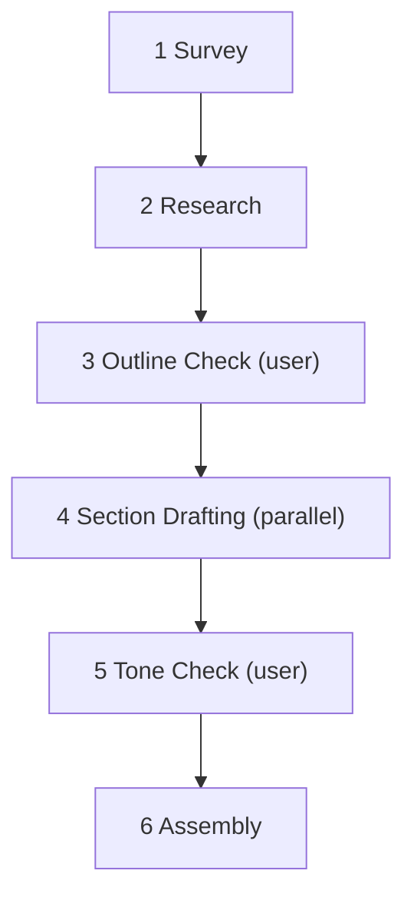

# The Briefer

The Briefer turns a plain-language question about a public technology or science topic into a short, structured explainer brief. Point it at any topic — how a bicycle stays upright, how a refrigerator moves heat, how a search index works — and it surveys the question, gathers a handful of verifiable facts, drafts an outline, splits the outline into sections, drafts each section, and assembles a final brief. This is a proof-of-concept pipeline: six steps, not eighteen, but every step is fully prescribed the same way.

---

### Step 0. Global Rules

**Zero-invention rule (HARD).** If a fact cannot be verified from a public source, omit it. No invented facts, no fabricated citations.

**Sub-agent handoff rule (HARD).** Sub-agents write their output to files and return one status line. The main context reads structured output from files, never from a sub-agent's return value.

**Slug rule.** `{slug}` is the kebab-case form of the topic, truncated to five words (e.g. "how vaccines train the immune system" becomes `how-vaccines-train-immune-system`). Derived once in Step 1.

**Date rule.** `{date}` is the run date in `YYYY-MM-DD`, derived once in Step 1. All files for a run live in `{date}-briefer-{slug}/`. Overwrite if the directory already exists; never import a prior run's files.

**Model tiers.** Two tiers only.
- **parent** — the same model running the main context; use for the steps that read, decide, or assemble.
- **fast** — a cheaper, faster model; use for section drafting, where the outline already carries the judgment.

---

### Step 1. Survey (main context, parent)

Identify the topic from the user's question. Derive `{slug}` and `{date}` per the rules above. Do not access the internet. Pass the topic, and any URL the user supplied, to Step 2.

---

### Step 2. Research (sub-agent, parent)

Sequential after Step 1. Sub-agent receives the topic and any user-supplied URL.

Inject the block below verbatim into the sub-agent's prompt, after the topic and before the task instructions — it is the fixed style guide for how a research fact should read.

<style_card>
Two example facts, for register only, never for content:
- "A bicycle's front wheel steers itself back under the rider's center of mass; this is why a coasting bike is more stable than a stationary one."
- "A refrigerator does not create cold — it moves heat from inside the box to the air behind it, using a compressor and a refrigerant that changes state."
</style_card>

Gather four to six verifiable facts about the topic from public sources. Write them to the evidence file `{date}-briefer-{slug}/evidence.md` (**scratch**), one bullet per fact, each with a one-line source note. Return one status line.

If the topic does not resolve to an identifiable public technology or concept — too vague, fictional, or unfindable — report that to the user and stop. State what's unclear about the topic.

---

### Step 3. Outline Check (main context)

Sequential after Step 2. Read the evidence file. Draft a three-section outline that would organize the facts into a short brief. Present the outline to the user through AskQuestion for confirmation, additions, or removals.

Ask once. Accept silence as confirmation of the drafted outline. **Append** the finalized outline to the evidence file under an Outline section.

---

### Step 4. Section Drafting (sub-agents, parallel, fast)

Waits for Step 3. Launch one sub-agent per outline section, in parallel — three sections, three sub-agents.

Each sub-agent receives its section title and the evidence bullets relevant to that section, extracted by the main context from the evidence file. Each sub-agent writes 3-5 sentences to its own numbered file `{date}-briefer-{slug}/section-{n}.md` (**scratch**), where the main context assigns `{n}` in outline order. Separate files prevent overlap between parallel sub-agents. Each sub-agent returns one status line.

---

### Step 5. Tone Check (main context)

Waits for all Step 4 sub-agents. Ask the user through AskQuestion: should the final brief read plain (no jargon) or technical (precise terms, defined once on first use)?

Ask once. Accept silence — default to plain. Record the answer for Step 6.

---

### Step 6. Assembly (main context, parent)

Read every `{date}-briefer-{slug}/section-{n}.md` file in outline order. Merge into one brief, applying the Step 5 tone choice throughout. Open with a one-sentence statement of the topic; close with the source notes gathered in Step 2, deduplicated.

Write the final brief to `{date}-briefer-{slug}/brief-{slug}.md`. Return this path as the run's output.
